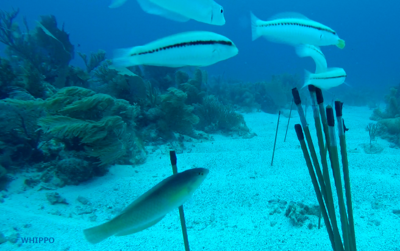
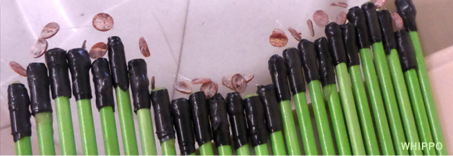
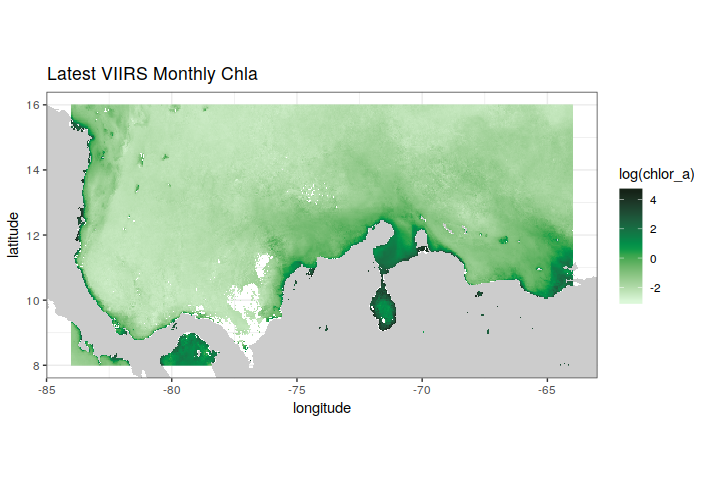
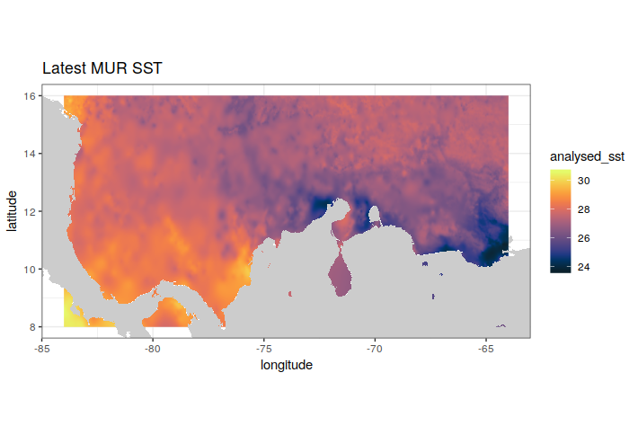
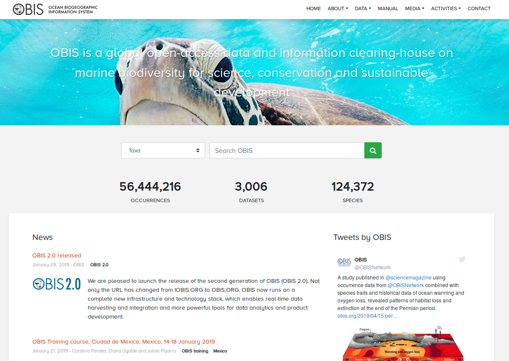

# Métodos

## Métodos de estudio para estimar cobertura y biomasa de pastos marinos

## Métodos para estimar la abundancia y composicion de peces asociados a los pastos marinos

Uno d elos métodos mas empleados para la caracterización de las comunidades de peces son los censos visuales. Durante el taller realizaremos un cesnos visual selectivo, utilizando registros videográficos en varios lugares durane un tiempo estándar. 

Durante el taller se contará con todos los materiales necesarios para la realización de esta actividad.

La metodología está detallada en la sección [Video Protocol](https://bitemap.wordpress.com/protocol/) 
del [Ocean Bitemap](https://bitemap.wordpress.com).

## Métodos para estimar la tasa de depredación de peces en pastos marinos (*SquidPops*)

Para estimar la intensidad de la depredación por parte d elos peces en sistemas de pastos marinos, [MarineGeo](https://marinegeo.si.edu/) ha desarrollado una metodología muy simple que se está aplicando en varias localidades en el mundo. 

Básicamente consiste en registrar el número de mordidas de peces a un conjunto de cebos durante un tiempo determinado. La estandarización del cebo y el tiempo hace que los datos sean comparables.

La metodología detallada, las referencias y un video que explica claramente el procedimiento se encuentra en la página de [Predation Assay](https://marinegeo.github.io/modules/predation-assay)

En el taller contaremos con todos los materiales necesarios para la realización de este experimento.

## Métodos para la extracción de datos satelitales de temperatura superficial del mar y clorofila

Los sensores remotos proveen de registros sistemáticos a diferentes escalas de algunas variables oceanográficas de interés para los estudios ecológicos. En este taller estaremos utilizando imágenes de satélite que permiten estimar valores de la temperatura superficial del mar (SST) y de la concetración de clorofila en el agua (CHLA).

Para ellos utilizaremos un conjunto de herramientas en R que nos permitirán extraer de modo programático valores de temperatura y de clorofila para sitios de interés, desde los servidores ERDDAP de la NASA.

Para esta actividad es necesario que los participantes tengan instalado el programa Rstudio y en él descargados los siguientes paquetes: 

- [lubridate](https://lubridate.tidyverse.org)
- [dplyr](https://dplyr.tidyverse.org)
- [ggplot2](https://ggplot2.tidyverse.org)
- [rerddap](https://github.com/ropensci/rerddap)
- [mapdata](https://cran.r-project.org/web/packages/mapdata/index.html)
- [reshape2](https://github.com/hadley/reshape)
- [tidyr](https://tidyr.tidyverse.org)

Para los que no están familiarizados o están oxidados en el uso de R pueden revisar el excelente libro [R for Data Science](https://r4ds.had.co.nz)

Por favor instalen estos paquetes **ANTES** de venir al taller.

## Métodos para el control de calidad y registro de datos en OBIS

Todoslos datos obtenidos durante el taller serán enviados al [Sistema de Información Biogeográfica de los Océanos OBIS](http://obis.org). Ene sta base de datos global se pueden extraer información de mas de 50 millones de registros integrados de mas de 125 mil especies marinas e mas de 3000 bases de datos diferentes. 

Nuestros datos estarán asociados al nodo [OBIS del Caribe](https://obis.org/node/8385435b-bcf5-4bec-b827-8b480163d479) y de ellos se podrá potencialmente generar un _data paper_ dónde los participantes dle taller serán los autores. 

El proceso de enviar los datos a OBIS para por estricto control de calidad que incluye el control de calidad taxonómica, haciendo la verificación con el Registro Mundial de especies Marinas [WoRMS](http://marinespecies.org) 

