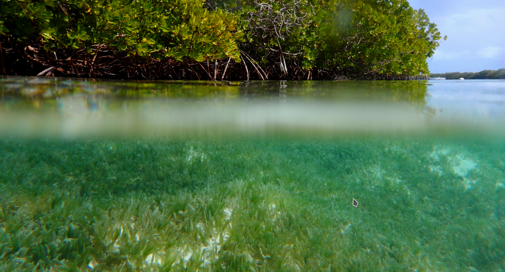

--- 
title: "Taller Métodos de Estudio de Fanerógamas Marinas"
author: "Santa Marta, 13-17 Mayo 2019"
date: "Última versión `r Sys.Date()`"
site: bookdown::bookdown_site
output:
  bookdown::gitbook:
    config:
      toc:
        collapse: none
        scroll_highlight: yes
      toolbar:
        position: fixed
      download: ["pdf"]
    split_by: none
    split_bib: yes
    highlight: tango
  bookdown::pdf_book:
documentclass: book
output_dir: "docs"
github-repo: diodon/seagrassWorkshop
description: "Sitio de información del taller de Fanerógamas Marinas, Santa Marta 13-17 Mayo 2019"
---


```{r setup, include=FALSE}
knitr::opts_chunk$set(echo = TRUE)
```




# Introducción

Este taller de entrenamiento tiene como objeto el de poner en práctica algunas técnicas modernas para el estudio de las comunidades de fanerógamas marinas. En especial: 

1. Distribución y abundancia  de fanerógamas marinas
2. Composición de la comunidad de peces asociada
3. Tasa de depredación de los peces asociados a las praderas de fanerógamas
4. Cobertura espacial de las praderas utilizando herramientas de senosres remotos
5. Extracción de variables oceanográficas (temperatura, salinidad, etc) mediante usos de herramientas satelitales

El taller cuenta con el apoyo del [INVEMAR](http://www.invemar.org.co) y los trabajos de campo se realizarán en una localidad del [Parque Nacional Tayrona](http://www.parquesnacionales.gov.co/portal/es/ecoturismo/region-caribe/parque-nacional-natural-tayrona/).


# Alcances esperados

Al final del taller se espera que los participantes hayan practicado las técnicas-objetivos y que puedan replicar estas en proyectos desarrolaldos en Venezuela, especialmente si ella forman parte de trabajos de grado de estudiantes.

# Instructores

- Patricia Miloslavich. Dep. Estudios Ambientales, Universidad Simón Bolivar. GOOS biology and Ecosystem Panel
- Eduardo Klein. Dep. Estudios Ambientales, Universidad Simón BOlívar. OBIS Steering Group co-Chair.
- Enrique Montes Herrera. Universidad del Sur de la Florida. Marione Biodiversity Observation Network. 
- Jonathan Lefcheck. Smithsonian Intitution. Marine GEO


# Participantes

   
